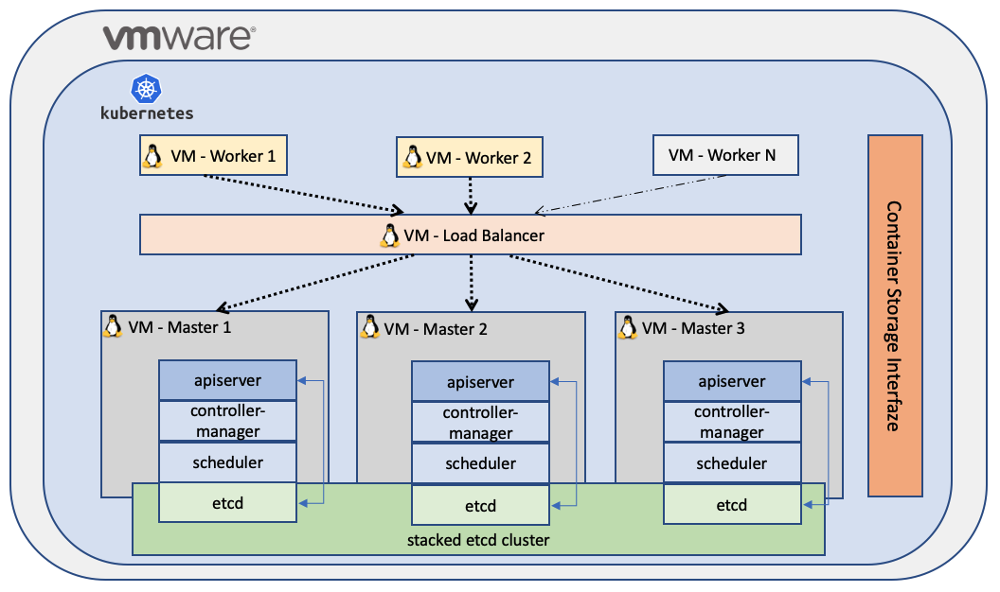

# Deploy Kubernetes with Ansible

Automated deployment of K8S cluster on CentOS7 with kubeadm
These ansible playbooks will help you deploy entire K8S cluster with dependencies on VMware vSphere.

## Steps 

Before launch these playbooks, take a minute to change some variables into the files.

- 1. Set variables in:
    roles/deploy-environment/tasks/main.yaml
- 2. Launch deploy-environment.yaml playbook.
- 3. Use ssh_copy_id file to configure private and public key from bastion to all VMs nodes.
- 4. Set variables in:
    roles/deploy-cluster/vars/main.yaml
- 5. Launch deploy-cluster.yaml playbook.

